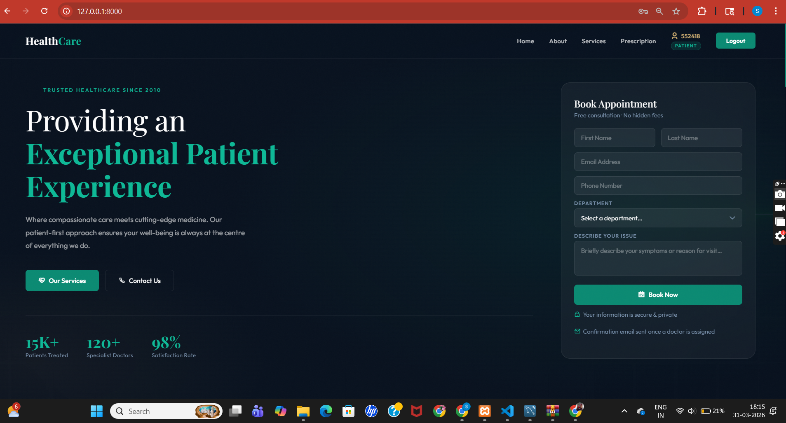
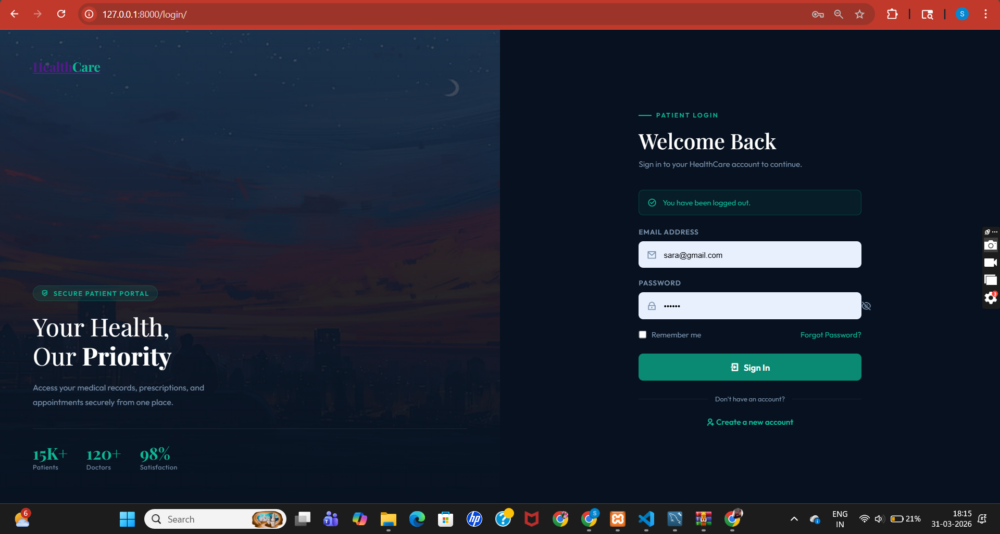
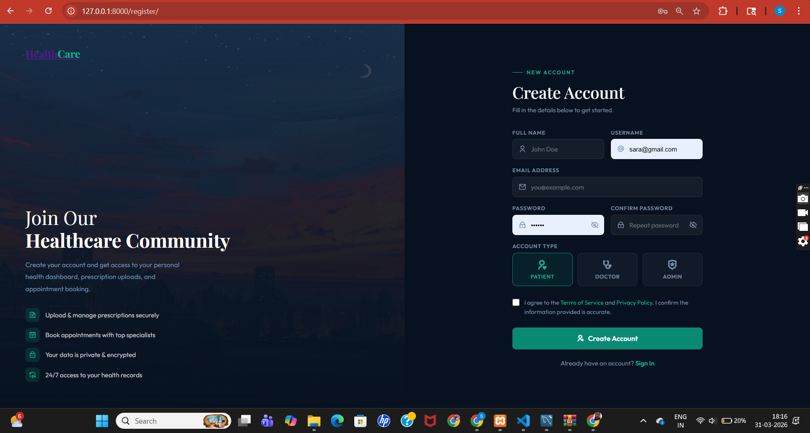
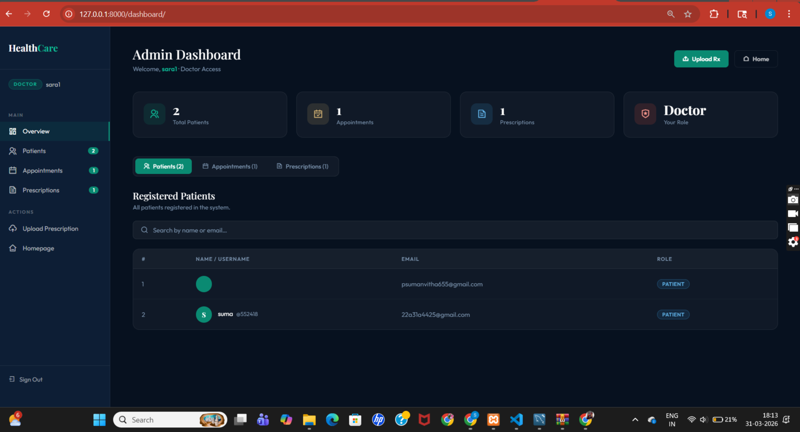

#  HealthCare — Patient Management Web Application

<div align="center">


**A full-stack Django healthcare web application with role-based access control,
secure prescription management, and an admin dashboard.**

[Live Demo](#) · [Report Bug](#) · [Request Feature](#)

</div>

---

## Preview

> **Home Page — Hero Section**



> *The landing page with appointment booking form, statistics, and navigation tailored to the logged-in user's role.*

---

##  Table of Contents

- [About The Project](#-about-the-project)
- [Features](#-features)
- [Role-Based Access System](#-role-based-access-system)
- [Tech Stack](#-tech-stack)
- [Project Structure](#-project-structure)
- [Database Models](#-database-models)
- [Screenshots](#-screenshots)
- [Getting Started](#-getting-started)
- [Deployment on Render](#-deployment-on-render)
- [How the Admin System Works](#-how-the-admin-system-works)
- [Security Features](#-security-features)
- [Contributing](#-contributing)

---

##  About The Project

**HealthCare** is a full-stack web application built with **Django 5.2** that allows patients to book appointments, upload prescriptions securely, and manage their personal health records — all from a clean, modern interface.

What makes this project unique is its **role-based access control system**. Every user is assigned a role — `patient`, `doctor`, or `admin` — and the entire application dynamically adapts based on who is logged in. Doctors and admins get elevated privileges including a dedicated dashboard that shows all patient records, appointments, and prescriptions across the system.

Prescription files are stored **directly in the database as binary data** (`BinaryField`), meaning no filesystem or cloud storage setup is required — making the app easier to deploy and more secure.

---

##  Features

### For Patients
-  **Book Appointments** — Fill a quick form directly from the homepage
-  **Upload Prescriptions** — Drag & drop PDF upload, stored securely in the database
- **Private Records** — Can only view and download their own files
-  **Account Management** — Register, login, and logout with session-based auth

### For Doctors & Admins
-  **Elevated Access** — Automatically granted after logging in with doctor/admin role
-  **Full Dashboard** — Tabbed view of all patients, appointments, and prescriptions
-  **View All Records** — See every patient's prescriptions and appointment history
-  **Download Any File** — Download any prescription uploaded by any patient
-  **Live Search** — Filter through patients, appointments, and prescriptions in real-time
---

##  Role-Based Access System

This is the core feature of the application. Every user has one of three roles:

| Role | Access Level | Dashboard | See All Records | Upload Prescriptions |
|------|-------------|-----------|-----------------|----------------------|
| `patient` | Basic | ❌ | ❌ Own only | ✅ |
| `doctor` | Elevated | ✅ | ✅ All patients | ✅ |
| `admin` | Full | ✅ | ✅ All patients | ✅ |

### How it works step by step:

```
1. User registers → selects role (Patient / Doctor / Admin)
2. User logs in → role is saved into Django session
3. Every page checks the session role
4. UI adapts → Dashboard link shown only to Doctor/Admin
5. Data filtered → Patients see only their own records
6. Routes protected → /dashboard/ blocked for patients
```

---

##  Tech Stack

| Layer | Technology |
|-------|-----------|
| **Backend** | Django 5.2.4 (Python) |
| **Database** | SQLite (via Django ORM) |
| **Frontend** | HTML5, CSS3, Vanilla JS |
| **Fonts** | Playfair Display + Outfit (Google Fonts) |
| **Icons** | Remix Icons v3.4 |
| **Server** | Gunicorn |
| **Static Files** | WhiteNoise |
| **Deployment** | Render |

---

##  Project Structure

```
myproject/
│
├── myproject/
│   ├── settings.py          # Project settings, DB config, static files
│   ├── urls.py              # Root URL configuration
│   ├── wsgi.py
│   └── templates/           # All HTML templates
│       ├── home.html        # Landing page
│       ├── login.html       # Login page
│       ├── register.html    # Registration with role selector
│       ├── prescription.html # Upload + view prescriptions
│       └── dashboard.html   # Admin/Doctor only dashboard
│
├── myapp/
│   ├── models.py            # Users, Appointment, Prescription models
│   ├── views.py             # All view logic + role decorators
│   └── admin.py
│
├── requirements.txt         # Minimal production dependencies
├── manage.py
└── test_db.sqlite3          # SQLite database file
```

---

##  Database Models

### `Users` Model
```python
class Users(models.Model):
    ROLE_CHOICES = [
        ('patient', 'Patient'),
        ('doctor', 'Doctor'),
        ('admin', 'Admin'),
    ]
    fullname  = models.CharField(max_length=100)
    username  = models.CharField(max_length=50, unique=True)
    email     = models.EmailField(unique=True)
    password  = models.CharField(max_length=50)
    role      = models.CharField(choices=ROLE_CHOICES, default='patient')
```

### `Prescription` Model — Binary File Storage
```python
class Prescription(models.Model):
    user              = models.ForeignKey(Users, on_delete=models.CASCADE)
    patient_name      = models.CharField(max_length=100)
    doctor_name       = models.CharField(max_length=100)
    file_name         = models.CharField(max_length=255)
    file_data         = models.BinaryField()       # ← File stored in DB, not filesystem
    file_content_type = models.CharField(max_length=100)
    uploaded_at       = models.DateTimeField(auto_now_add=True)
```

> **Why BinaryField?** Storing files in the database means zero configuration for file storage. No AWS S3, no media folders, no extra setup. Just run and deploy.

### `Appointment` Model
```python
class Appointment(models.Model):
    user       = models.ForeignKey(Users, on_delete=models.CASCADE)
    first_name = models.CharField(max_length=100)
    last_name  = models.CharField(max_length=100)
    email      = models.EmailField()
    phone      = models.CharField(max_length=15)
    created_at = models.DateTimeField(auto_now_add=True)
```

---

## 📸 Screenshots

### Home Page


*Landing page with video background, appointment booking form, and role-aware navigation.*

---

### Login Page



*Split-panel login with branding on the left and secure form on the right. Includes show/hide password toggle.*

---

### Register Page



*Registration form with the role selector — users pick Patient, Doctor, or Admin when signing up.*

### Admin Dashboard



*The full dashboard with sidebar navigation, stat cards, and tabbed tables for patients, appointments, and prescriptions.*

## Getting Started

### Prerequisites

- Python 3.11+
- pip

### Installation

**1. Clone the repository**
```bash
git clone https://github.com/yourusername/healthcare-django.git
cd healthcare-django
```

**2. Create a virtual environment**
```bash
python -m venv venv

# Windows
venv\Scripts\activate

# Mac/Linux
source venv/bin/activate
```

**3. Install dependencies**
```bash
pip install -r requirements.txt
```

**4. Run migrations**
```bash
python manage.py makemigrations
python manage.py migrate
```

**5. Start the development server**
```bash
python manage.py runserver
```

**6. Open in browser**
```
http://127.0.0.1:8000/
```

---

## Deployment on Render

**1. Push your code to GitHub**

**2. Create a new Web Service on [Render](https://render.com)**

**3. Set the following:**

| Setting | Value |
|---------|-------|
| Build Command | `pip install -r requirements.txt` |
| Start Command | `gunicorn myproject.wsgi:application` |
| Environment | Python 3 |

**4. Add these to `settings.py` for production:**
```python
# WhiteNoise for static files
MIDDLEWARE = [
    'django.middleware.security.SecurityMiddleware',
    'whitenoise.middleware.WhiteNoiseMiddleware',  # ← add this
    ...
]

STATIC_ROOT = BASE_DIR / 'staticfiles'
ALLOWED_HOSTS = ['your-app-name.onrender.com']
```

**5. Add build command to collect static files:**
```bash
pip install -r requirements.txt && python manage.py collectstatic --noinput && python manage.py migrate
```

---

##  How the Admin System Works

### 1. Role stored in the database
When a user registers, their chosen role (`patient`, `doctor`, `admin`) is saved to the `Users` table.

### 2. Role saved to session on login
```python
request.session['role'] = user.role
```

### 3. Views protected with decorators
```python
@admin_or_doctor_required   # blocks patients entirely
def admin_dashboard(request):
    ...
```

### 4. Data filtered by role in views
```python
if user.is_admin_or_doctor:
    prescriptions = Prescription.objects.all()          # all records
else:
    prescriptions = Prescription.objects.filter(user=user)  # own records only
```

### 5. Download security check
```python
def download_prescription(request, pk):
    if not user.is_admin_or_doctor and prescription.user != user:
        raise Http404("File not found.")  # patient can't access others' files
```

### 6. Templates adapt to role
```django

    <a href="">Dashboard</a>

```

---

## Security Features

| Feature | Implementation |
|---------|---------------|
| **Route Protection** | Custom `@login_required_view` decorator |
| **Role Enforcement** | Custom `@admin_or_doctor_required` decorator |
| **File Ownership** | Download view checks `prescription.user == request_user` |
| **CSRF Protection** | Django's built-in `` on all forms |
| **Session Auth** | Django session middleware — no JWT needed |
| **404 on Unauthorized** | Patients get `Http404` instead of `403` to avoid leaking info |

---

##  Contributing

Contributions are welcome! Here's how:

1. Fork the repository
2. Create a feature branch — `git checkout -b feature/AmazingFeature`
3. Commit your changes — `git commit -m 'Add AmazingFeature'`
4. Push to the branch — `git push origin feature/AmazingFeature`
5. Open a Pull Request

---

##  License

Distributed under the MIT License. See `LICENSE` for more information.

---

## Author

Developed by S S V Sumanvitha Palivela.

---

<div align="center">
  <strong>⭐ Star this repo if you found it helpful!</strong>
</div>
